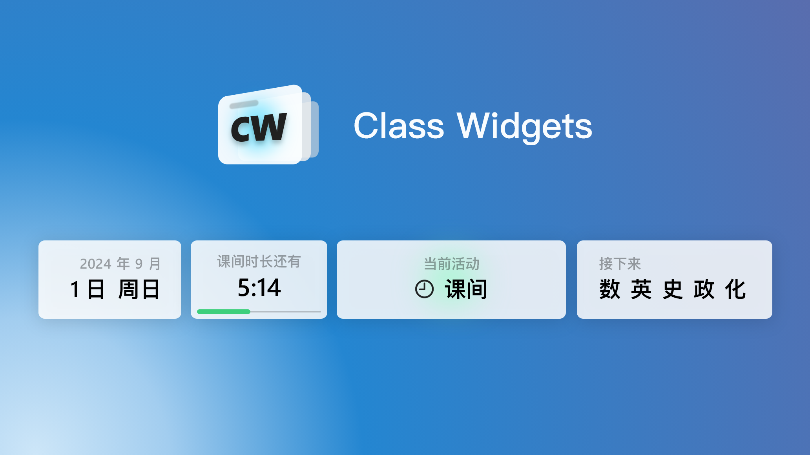

  

  <h1 align="center">
  Class Widgets
</h1>

  一款桌面课表 App

## 安装&使用
下载 Release 中最新版的压缩文件，解压到合适位置后，打开 `ClassWidgets.exe` 即可。
可通过托盘菜单进入设置、或退出此程序。

## 协议
此项目 (Class Widgets) 基于 GPL-3.0 许可证授权发布，详情请参阅 [LICENSE](./LICENSE) 文件。

Copyright © 2024 RinLit.

## 引用
此程序引用了[zhiyiYo](https://github.com/zhiyiYo/)的[PyQt-Fluent-Widgets](https://github.com/zhiyiYo/PyQt-Fluent-Widgets)
作为设置的 UI 界面

##
这仅是我作为新人的练习作品，欢迎提供更多意见！
