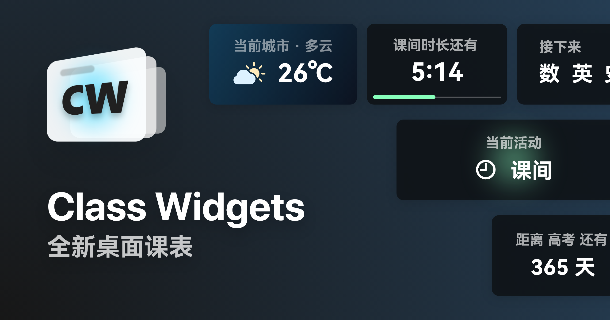
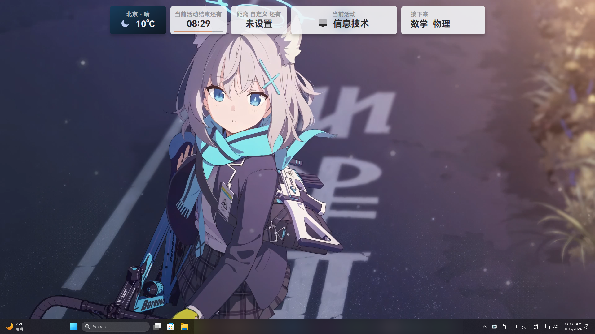
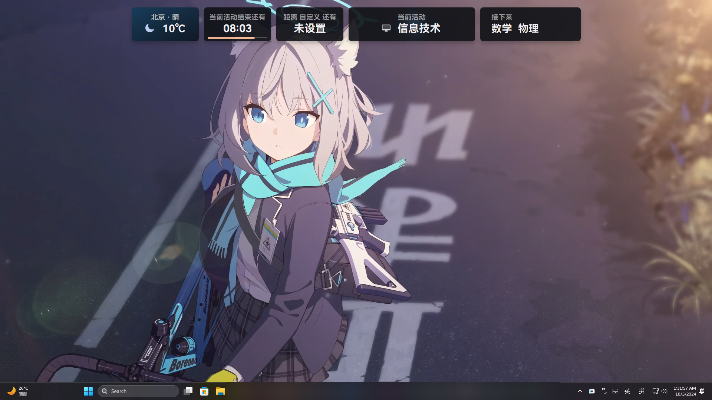

  

  <h1 align="center">
  Class Widgets
</h1>

 全新桌面课表

#### [了解更多 >](https://www.bilibili.com/video/BV1xwW9eyEGu/)

## 特性
- 将今日的课程安排以**小组件**的样式为你呈现；
- 具有 [上下课提醒](https://www.yuque.com/rinlit/class-widgets_help/fv2ou1i1ngap0hrl) 和预备铃；
- 拥有主题系统支持你高度自定义。
- 简洁直观的 [课程表编辑](https://www.yuque.com/rinlit/class-widgets_help/oozelh8r56tmw0xb) 界面；
- 同时存储多个课程表文件，并能在各个 Class Widgets 导入和导出；
- 提供快捷的调休、换课 [应对方案](https://www.yuque.com/rinlit/class-widgets_help/gc4epffu7g5bf9os)。
- 提供“天气”、“自定义倒计时”等实用小组件；
- 通过 [“自定义”](https://www.yuque.com/rinlit/class-widgets_help/qyly70ht1ogge1pi) 个性化你的 Class Widgets；
- 具有亮/暗色主题；
- ……

## 软件截图
#### 主界面(亮色)

#### 主界面(暗色)

## 安装&使用
> [!TIP]
> 可在 [Class Widgets 官方文档](https://www.yuque.com/rinlit/class-widgets_help/gs3gsbms1iivgibm) 查看教程。

下载  中最新版的压缩文件，解压到合适位置后，打开 `ClassWidgets.exe` 即可。
可通过托盘菜单进入设置、或退出此程序。

## 协议
此项目 (Class Widgets) 基于 GPL-3.0 许可证授权发布，详情请参阅 [LICENSE](./LICENSE) 文件。

Copyright © 2024 RinLit.

# 致谢

## 第三方库和框架

- [PyQt6](https://www.riverbankcomputing.com/static/Docs/PyQt6/)
- [PyQt-Fluent-Widgets](https://github.com/zhiyiYo/PyQt-Fluent-Widgets)
- [Loguru](https://github.com/Delgan/loguru)
- [Request](https://github.com/psf/requests)
- [SoundFile](https://github.com/bastibe/python-soundfile)
- [SoundDevice](https://github.com/spatialaudio/python-sounddevice)

## 资源

- [SF Symbols](https://developer.apple.com/sf-symbols/) （部分图标已做修改）
- [和风天气图标](https://icons.qweather.com/)（部分图标已做修改）
- [HarmonyOS Sans](https://developer.huawei.com/consumer/cn/design/resource/)

## 贡献者

## 星标历史
<picture>
  <source
    media="(prefers-color-scheme: dark)"
    srcset="
      https://api.star-history.com/svg?repos=RinLit-233-shiroko/Class-Widgets&type=Date&theme=dark
    "
  />
  <source
    media="(prefers-color-scheme: light)"
    srcset="
      https://api.star-history.com/svg?repos=RinLit-233-shiroko/Class-Widgets&type=Date&theme=dark
    "
  />
  
</picture>

##
这仅是我作为新人的练习作品，欢迎提供更多意见！
